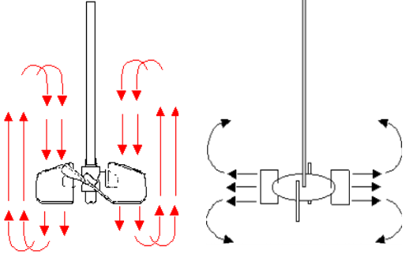
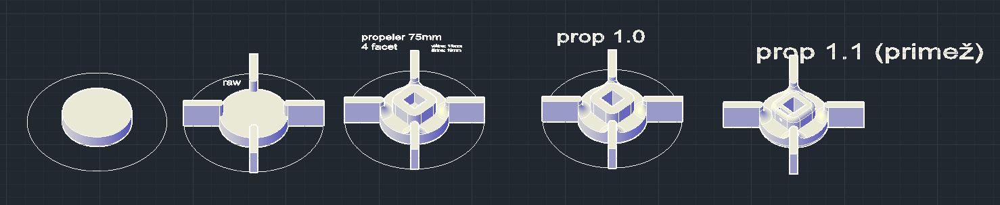
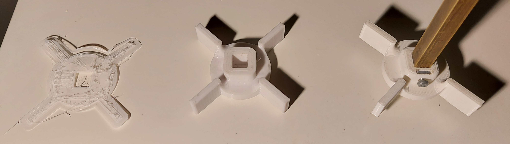

# Bioreactor

## Motivation and challanges

Author:  **Matija Šavli**  
Me and my friend [Lan Vukusic](https://github.com/LanVukusic) started brewing beer. One time we ran out of yeast so we had to use the sediment from a bottle of an older batch of beer. I cultivated the yeast in a small jar so that the inoculum containted enough yeast to pitch the wort. I wanted to optimize the process so i came to the idea that i want to make my own bioreactor.  

## Designing parts

We had a general idea in mind of what the finished product should look like, but we made no hard plans. We are aware that most of the things we plan wont work out or way better options will become obvious.
We were, however sure that we needed the following parts:

- [Jar lid](#jar-lid)
- [Mixer](#mixer)
  - and many pieces for it to work
- Motor holder
- Temperature probe mount
- Bubbler
- Sample retreving mechanism
- Electronics housing

Next chapters describe the design of the parts, iterations and problems along the way.

### Jar lid

We've decided that the base container for our reactor will be a 5 liter glass jar that we got for around `4€`. It was big enough, cheap and good quality. Overall a great buy.
The most logical way to mount all the sensors and actuators was to make a air tight lid that covers the jar, serves as a cover to keep the reactor sterile and allow us to mount arbitrary stuff on it.

The hard part was designing the thread and an accurate diameter of the lid to be able to close it tightly. We made a series of test prints with different radii to find the one that fits the tightest.

The test print that we were comfortable with was printed and is shown on the bottom right.  

Finding the radius that fits was not that difficult, but finding the correct way to make a thread was a bit challenging. It was difficult to measure the angle of teeth that grab the jar so trial and error was again the only viable option.  

The final option printed just great and allowed for a tight screw on.

### Mixer

The ability to mix the contents of the reactor is a crucial part to make sure that aeration is good and to prevent any sediment. Ideally, one would want to have micro-organisms distributed evenly inside the medium.  

The design of the mixer blades was not trivial since it has to follow know guidelines for designing a bioreactor.

The reactor has a dimeter of `d = 180mm` and height of roughly `h = 220mm`.
The diameter `d_blade` and height `h_blade` of mixer blades can be calculated as follows:  

$$
d_{blade} = \frac{d}{3} = \frac{180}{3} = 60
$$
$$
h_{blade} = \frac{d_{blade}}{5} = \frac{60}{5} = 12
$$

With the sizes calculated, only thing left to choose was the shape of the mixer.  

Firstly we had to choose between `axial` (left) and `radial` (right) mixer heads:  

 Different positioning and angles of the blades have their own pros and cons.  

| Mixer head | pros | cons |
| :---: | --- | --- |
| Axial | More efficient, good for sensitive microorganisms, better vertical circulation | lower sheer forces |
| Radial | High sheer forces | less efficient, worst vertical circulation |

> **sheer forces** are great for generating turbulence that break apart air bubbles into smaller ones which allows for better aeration of the medium (more surface area allows for better diffusion of gases).
> Down side is that sensitive organisms (fungi cells-filamentous and some animal cells) can be easily damaged by those forces.  

We mostly want to grow yeast which grows best in the pressence of oxygen and have therefore decided to go with the **radial head**. The efficiency loss and worse
vertical circulation are negligible for the reactor of this size(we need a source lel).  

The designed part has an added mounting piece, so it can fit a screw to tighten it to the lead.  

The final part was printed from the last (right most) design:  

  

### Motor
For the motor we used a stepper motor that we found in an absolete ink printer. We had to buy a driver board so we could actually drive the motor.  
### Transfer of power
We used a belt system.  
### Axel
For the axel shaft we used a metal rod diameter of 1 mm.  
### Air supply
We decided to buy a aquarium air pump to fulfil the need for oxygen.